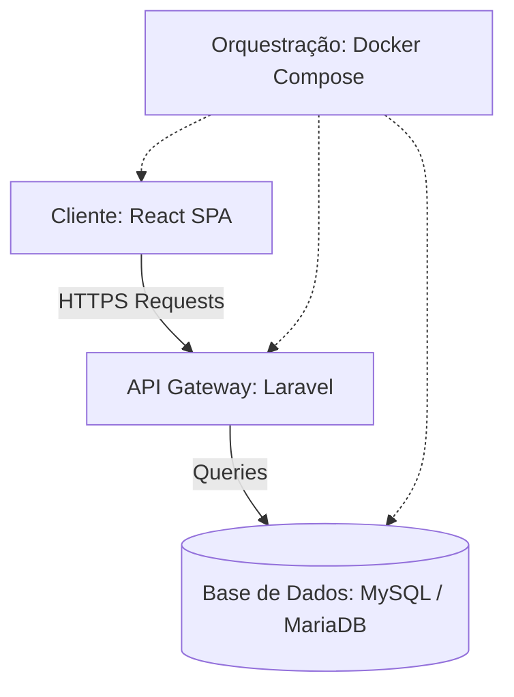

# DJDex - O teu indexador pessoal de DJs, Festivais e Sets

O **DJDex** é uma plataforma web moderna e integrada, concebida para indexar, catalogar e analisar informações detalhadas sobre DJs, festivais de música e sets de atuações ao vivo. O ecossistema oferece uma experiência fluida para utilizadores convidados e gestores, combinando um frontend intuitivo baseado em SPA com um backend robusto em formato API RESTful.

---

## Arquitetura do Ecossistema

O projeto adota uma arquitetura desacoplada para separar as responsabilidades de cliente e servidor em dois diretórios autónomos. A infraestrutura completa é orquestrada de forma isolada através de containers Docker.



### Componentes da Aplicação

*   **Frontend (`/frontend`)**:
    *   **Tecnologias**: React, Vite, Tailwind CSS, Recharts.
    *   **Descrição**: Interface de utilizador rica e de elevada performance, desenhada com componentes interativos, navegação dinâmica por rotas, painéis estatísticos responsivos e transições suaves.
*   **Backend (`/backend`)**:
    *   **Tecnologias**: Laravel 11, API Sanctum, MySQL / MariaDB.
    *   **Descrição**: Servidor encarregue da persistência de dados, processamento de ficheiros, autenticação e autorização de utilizadores, expondo endpoints seguros para consumo pela aplicação cliente.
*   **Orquestração (Docker)**:
    *   **Descrição**: Ambiente virtualizado que isola cada camada do ecossistema, permitindo o arranque imediato de toda a stack sem necessidade de instalar dependências locais.

---

## Funcionalidades Implementadas

O DJDex foi construído com as seguintes capacidades operacionais:

*   **CRUD Completo com Upload de Média**:
    *   Gestão detalhada das entidades principais: DJs, Festivais e Sets.
    *   Persistência física e dinâmica de imagens estruturadas na seguinte árvore de caminhos: `images/{entidade}/{id}/{ficheiro}`.
*   **Painel Analítico de Estatísticas**:
    *   Processamento e agregação de dados em tempo real da base de dados.
    *   Visualização gráfica interativa da distribuição de géneros musicais.
    *   Métricas agregadas sobre a popularidade e lotação de festivais.
    *   Análise da duração acumulada de sets registados.
*   **Sistema Híbrido de Autenticação**:
    *   **Acesso Público (Convidados)**: Perfil restrito para consulta rápida de DJs, festivais e sets, incluindo a visualização interativa do painel estatístico.
    *   **Cadeado de Escrita (Administrador)**: Controlo restrito de gravação e modificação de registos (criação, edição e remoção) protegido por tokens de sessão.

---

## Como Executar Localmente

### Pré-requisitos
*   [Docker](https://www.docker.com/) e Docker Compose instalados no sistema de destino.

### Passo a Passo de Instalação

1.  **Configurar Variáveis de Ambiente**:
    Crie o ficheiro de configuração local para o backend a partir do modelo de exemplo:
    ```bash
    cp backend/.env.example backend/.env
    ```

2.  **Iniciar a Stack com Docker**:
    Execute o comando na raiz do projeto para construir as imagens e iniciar os serviços:
    ```bash
    docker compose up --build
    ```
    Após a inicialização bem-sucedida, as aplicações estarão acessíveis nas seguintes portas:
    *   **Frontend (React/Vite)**: [http://localhost:5173](http://localhost:5173)
    *   **Backend (Laravel API)**: [http://localhost:8000](http://localhost:8000)

3.  **Preparar a Base de Dados**:
    Com os containers em execução, corra as migrações e popule a base de dados com registos reais executando os comandos Artisan no container do backend:
    ```bash
    docker compose exec backend php artisan migrate:fresh --seed
    ```
